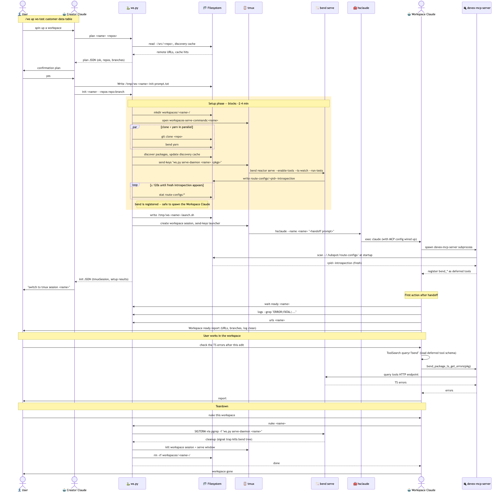
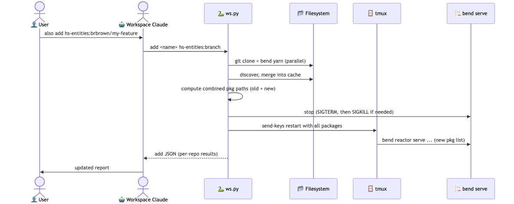

# ws skill

Orchestrates multi-repo dev workspaces: git clones, `bend reactor serve`, tmux, and a nested Workspace Claude — all glued together by a single Python CLI (`scripts/ws.py`).

- **Operating manual** (what to do as creator / workspace Claude): [`SKILL.md`](SKILL.md)
- **Architecture** (component roles, ordering constraints, why things are the way they are): [`ARCHITECTURE.md`](ARCHITECTURE.md)

## Sequence diagrams

### Create → work → tear down



Source: [`diagrams/sequence-full.mmd`](diagrams/sequence-full.mmd).

### Adding a repo to a live workspace



Source: [`diagrams/sequence-add.mmd`](diagrams/sequence-add.mmd).

## Regenerating the diagrams

The `.mmd` files in `diagrams/` are the source of truth. If you edit one, rerun the corresponding `mmdc` invocation below to update its PNG, then commit both the `.mmd` and the `.png`.

```bash
cd .claude/skills/ws/diagrams

npx -p @mermaid-js/mermaid-cli mmdc \
  -i sequence-full.mmd -o sequence-full.png \
  -b white -t default -w 1600

npx -p @mermaid-js/mermaid-cli mmdc \
  -i sequence-add.mmd -o sequence-add.png \
  -b white -t default -w 1200
```

Tips for editors (human or agent):

- Edit the `.mmd` file, not the `.png` — the PNG is generated output.
- Keep actor/participant names short; mermaid's auto-layout gets wide quickly with 8–9 columns.
- Use `Note over X,Y:` for phase labels, and `rect rgb(r,g,b)` for visually grouping a phase. Stick to light colors — dark rects hide the text inside them at render time.
- After regenerating, open the `.png` to eyeball it before committing. `mmdc` runs Chromium under the hood; silent font/layout regressions do happen.
- If `mmdc` fails with a sandbox error, it's the bundled Chromium — rerun once, or pass `--puppeteerConfigFile` with `{"args": ["--no-sandbox"]}` if this becomes a recurring issue.
